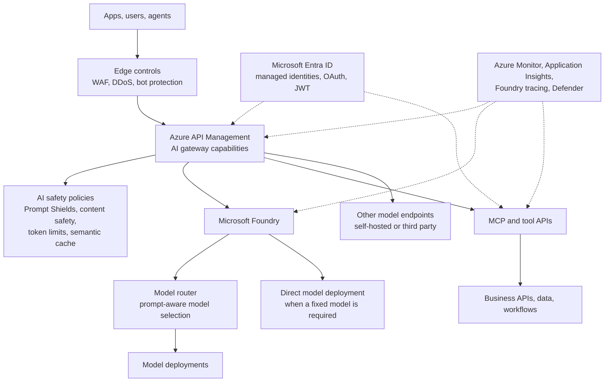

# Azure AI gateway field guide

Last reviewed: May 2026

This repository is a public field guide for architects who need to govern Microsoft Foundry, Azure API Management (APIM) AI gateway, model router, MCP tools, and web application firewall (WAF) controls in one design.

The short version: use APIM as the governed entry point for AI traffic, use model router when you want prompt-aware model selection inside Foundry, keep a WAF for classic web threats, and add AI-specific controls for prompt, response, token, tool, and agent risks.

This is not official Microsoft documentation. It is a practitioner guide built from public Microsoft, OWASP, and vendor sources. Always validate service availability, preview status, limits, and pricing in the current product documentation before you design around a feature.

## Architecture

## What this guide consolidates

The material in this repository replaces several smaller notes about:

- APIM AI gateway capabilities.
- Model router compared with APIM gateway routing.
- Whether a WAF is enough for AI workloads.
- MCP gateway and agent tool governance.
- OWASP LLM and agentic AI risks mapped to Microsoft controls.

The source material has been deduplicated into one set of public-facing guidance. This repository does not include private source history or bulky video assets.

## Decision summary

| Question | Use this control | Why |
|---|---|---|
| Do I need one governed entry point for model, agent, and tool traffic? | APIM AI gateway | It centralizes authentication, authorization, token quotas, routing, safety policies, logging, and developer access. |
| Is the problem "which model should answer this prompt?" | Model router | It is a Foundry model deployment that routes each prompt to an eligible underlying model based on quality, cost, latency, and routing mode. |
| Is the workload public-facing over HTTP? | WAF plus AI-specific controls | WAF handles classic web threats. It does not understand prompt injection, tool misuse, semantic data leakage, or runaway token spend. |
| Are agents calling tools through MCP? | APIM as MCP gateway plus API Center registry | Agents need governed access to tools, schema validation, authentication, quotas, monitoring, and approved server discovery. |
| Are you building autonomous or multi-agent systems? | Layered controls | Use identity, gateway policy, content safety, tool allowlists, tracing, circuit breakers, and human approval for high-impact actions. |

## Start here

1. Read [Reference architecture](docs/architecture.md) for the layered pattern.
2. Read [APIM AI gateway](docs/apim-ai-gateway.md) for the control point.
3. Read [Model router vs APIM](docs/model-router-vs-apim.md) for routing responsibilities.
4. Read [WAF and AI firewalls](docs/waf-and-ai-firewalls.md) if you need to explain why a WAF is necessary but not sufficient.
5. Read [MCP and tool governance](docs/mcp-tool-governance.md) for agent tool security.
6. Use the [Implementation checklist](docs/implementation-checklist.md) before a design review.

## Scope and non-goals

This repository focuses on architecture and decision guidance. It is not a deployment accelerator, a Terraform module, a Bicep template, or a product support boundary. It does not replace Microsoft Learn, OWASP guidance, your threat model, or your organization's security review.

In this guide, WAF means web application firewall. It does not mean the Azure Well-Architected Framework unless explicitly stated.

## Repository map

| File | Purpose |
|---|---|
| [docs/architecture.md](docs/architecture.md) | Layered architecture and traffic flow. |
| [docs/apim-ai-gateway.md](docs/apim-ai-gateway.md) | APIM AI gateway capabilities and control mapping. |
| [docs/model-router-vs-apim.md](docs/model-router-vs-apim.md) | Clear distinction between model router and gateway routing. |
| [docs/waf-and-ai-firewalls.md](docs/waf-and-ai-firewalls.md) | WAF, AI firewall, Prompt Shields, and decision guidance. |
| [docs/mcp-tool-governance.md](docs/mcp-tool-governance.md) | MCP gateway risks and mitigations. |
| [docs/owasp-control-map.md](docs/owasp-control-map.md) | OWASP LLM and agentic risks mapped to Microsoft controls. |
| [docs/implementation-checklist.md](docs/implementation-checklist.md) | Review checklist for production designs. |
| [docs/source-map.md](docs/source-map.md) | Deduplication map from the original research threads. |
| [docs/references.md](docs/references.md) | Public references used by the guide. |
