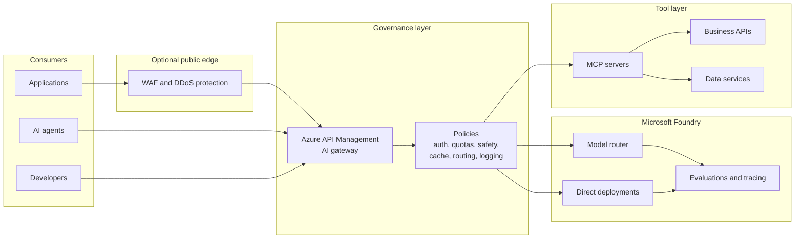

# Reference architecture

This pattern puts Azure API Management at the center of AI traffic governance. It does not require every AI workload to be public-facing, and it does not make APIM the only control. It gives you one policy point for authentication, quota, safety, routing, monitoring, and tool access.

## Layer responsibilities

| Layer | Primary responsibility | What it should not be expected to do |
|---|---|---|
| Edge WAF | Protect public HTTP endpoints from classic web threats, bots, request floods, and known exploit patterns. | Understand prompt intent, agent goals, model output truthfulness, or MCP tool semantics. |
| APIM AI gateway | Govern AI APIs, model endpoints, MCP servers, and A2A APIs with policy, identity, quotas, routing, logging, and safety integration. | Replace model evaluation, data governance, identity governance, or application authorization. |
| Microsoft Foundry | Host models, agents, evaluations, tracing, and model router deployments. | Act as a cross-organization gateway for every model, tool, and third-party endpoint. |
| Model router | Select an eligible underlying model per prompt inside a Foundry deployment. | Provide enterprise API governance, cross-cloud routing, custom policy, or developer portal workflows. |
| MCP and tools | Expose external data and actions to agents through governed tool contracts. | Be trusted just because the model requested a tool call. Tool calls still need identity, authorization, schema validation, logging, and rate limits. |
| Observability | Correlate token use, latency, failures, prompt safety events, tool calls, and agent traces. | Rely only on application logs. Multi-agent failures cross service boundaries. |

## Design principles

### Put policy where traffic converges

Applications should not call every model and tool directly. Route traffic through a gateway when you need shared controls across teams, environments, and workloads.

### Keep model selection and traffic governance separate

Model router selects a model for a prompt. APIM governs who can call, how much they can spend, which backends are allowed, what is logged, and which safety checks run.

### Treat tools as production APIs

An MCP tool can read data, write records, send messages, or call another system. Treat it like any other production API: register it, authenticate it, authorize it, validate inputs, monitor it, and apply change control.

### Keep the WAF, but do not stop there

A WAF remains useful for public HTTP exposure. It does not replace Prompt Shields, content safety, output validation, token budgets, tool-call allowlists, or agent tracing.

## Recommended control stack

| Risk | Control stack |
|---|---|
| Prompt injection and jailbreaks | Prompt Shields or equivalent input screening, model/system prompt hardening, application authorization, APIM request policies, and runtime detection. |
| Token exhaustion and runaway cost | APIM token limits, per-consumer quotas, model capacity planning, semantic caching, budget alerts, and circuit breakers. |
| Backend throttling or outage | APIM backend pools, priority or weighted routing, retry policies, circuit breaker, and regional deployment strategy. |
| Sensitive data leakage | Microsoft Purview controls, data-source authorization, output filtering, response logging policy, and DLP review. |
| Tool misuse | API Center or tool registry, APIM as MCP gateway, strict schema validation, per-tool authorization, and human approval for high-impact actions. |
| Cascading agent failure | Per-session token and tool-call budgets, OpenTelemetry traces, APIM quotas, Azure Monitor alerts, and kill-switch procedures. |
