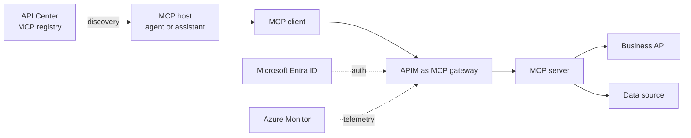

# MCP and tool governance

Model Context Protocol (MCP) lets agents and LLM applications connect to tools and external data sources. That makes MCP a production security boundary, not just a developer convenience.

APIM can expose REST APIs as MCP servers and can govern existing remote MCP servers. Use this when agents need access to enterprise tools with centralized authentication, authorization, quotas, monitoring, and policy.

## MCP architecture in one view

## Why MCP needs a gateway

MCP tools can expose actions such as read customer data, update a ticket, send an email, query a database, or trigger a workflow. If an agent can call a tool, an attacker who influences the agent may be able to influence that tool call.

The gateway gives you a place to enforce policy before the tool executes.

## Common risks

| Risk | What happens |
|---|---|
| Tool poisoning | Malicious instructions are embedded in tool names, descriptions, schemas, or returned context. |
| Rug pull | A previously approved tool changes behavior or metadata after approval. |
| Tool shadowing | A malicious tool uses a confusingly similar name or schema. |
| Parameter abuse | The agent calls an authorized tool with unexpected or unsafe parameters. |
| Credential relay | Tokens or credentials are replayed across tools, agents, or sessions. |
| Over-broad tools | A single tool exposes too much power, such as read and write access across unrelated systems. |
| Missing audit trail | Tool calls are not correlated to user, agent, session, prompt, and downstream action. |

## Recommended controls

| Control | Implementation idea |
|---|---|
| Registry and discovery | Register approved MCP servers in Azure API Center or an equivalent enterprise catalog. Do not let agents discover arbitrary tools at runtime. |
| Gateway enforcement | Route remote MCP servers through APIM so policies apply consistently. |
| Authentication | Require Microsoft Entra ID or another trusted identity provider. Validate JWTs at the gateway. |
| Authorization | Scope access by agent, user, app, environment, and tool. Separate read tools from write tools. |
| Schema validation | Reject parameters that do not match approved schemas. Avoid permissive "additional properties" in tool contracts. |
| Rate limits and quotas | Set per-agent and per-tool limits. Use stricter limits for write tools. |
| Version pinning | Pin approved tool definitions and require review before metadata or schema changes. |
| Signing and provenance | Use signed artifacts and supply-chain attestations for tool packages where possible. |
| Monitoring | Emit correlation IDs and log tool name, caller identity, session, action type, outcome, latency, and policy decision. |
| Human approval | Require approval for high-impact tool calls. |

## APIM-specific notes

APIM supports two built-in MCP exposure patterns:

- Expose a REST API managed in APIM as an MCP server.
- Expose and govern an existing MCP-compatible remote server through APIM.

Current Microsoft Learn notes include important limitations. APIM MCP capabilities support tools, but not MCP resources or prompts. MCP capabilities are not currently supported in APIM workspaces. Validate current tier support before designing around this feature.

## Tool design checklist

Use this checklist before you expose a tool to agents:

1. Define the smallest useful action. Prefer separate tools for read, create, update, and delete.
2. Require identity for every call. Avoid shared secrets in agent prompts or code.
3. Validate every parameter at the gateway and backend.
4. Log every decision and every downstream action.
5. Set a token, call, and time budget for each agent run.
6. Require human approval for irreversible or external actions.
7. Test indirect prompt injection through tool metadata and returned data.
8. Review tool changes before agents can use a new version.
