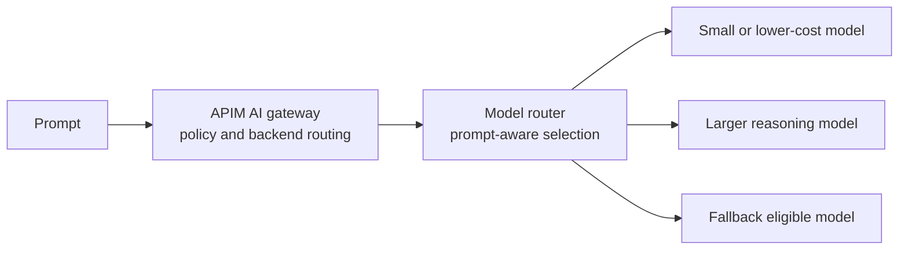
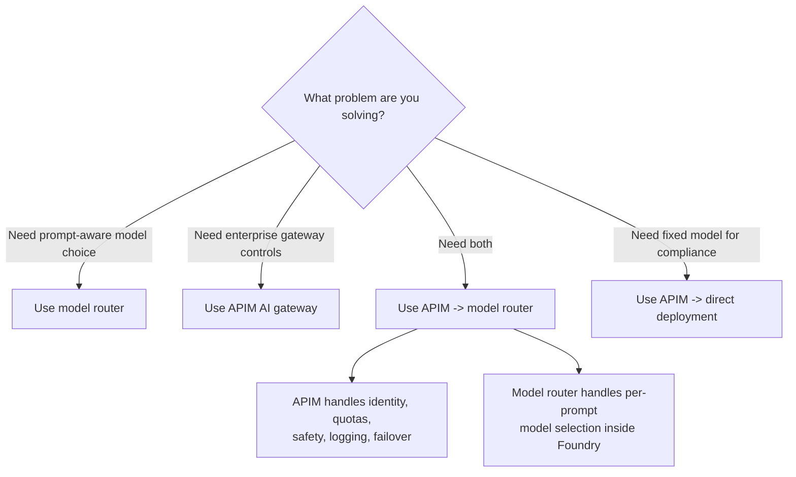

# Model router vs APIM AI gateway

Model router and APIM AI gateway solve different problems. They work well together, but they are not interchangeable.

| Component | Plain-English definition |
|---|---|
| Model router | A Microsoft Foundry model deployment that analyzes each prompt and routes it to an eligible underlying model based on routing mode, model subset, quality, cost, latency, and availability. |
| APIM AI gateway | Azure API Management used as the policy and traffic control point for AI APIs, model endpoints, MCP servers, A2A APIs, and tools. |

## Key difference

Model router understands prompts. APIM understands traffic, policy, identity, quotas, routing rules, and backends.

## Side-by-side comparison

| Dimension | Model router | APIM AI gateway |
|---|---|---|
| Primary job | Select the best eligible model for a prompt. | Govern AI traffic and enforce policy. |
| Routing basis | Prompt semantics, quality, cost, latency, model eligibility, and routing mode. | Rules, backends, priorities, weights, health, identity, quotas, and policies. |
| Scope | Inside a Foundry model deployment. | Across APIs, regions, teams, providers, MCP servers, and tools. |
| Multi-cloud | No. It routes among supported Foundry models. | Yes, for HTTP-accessible backends that APIM can manage. |
| Token quotas | Not the main purpose. | Core gateway use case. |
| Developer portal and subscriptions | No. | Yes. |
| Blue-green and canary traffic | Not the main purpose. | Use APIM backend pools and routing policy. |
| Prompt-aware model choice | Yes. | No. |
| Best fit | Cost-quality optimization for a prompt stream. | Enterprise governance, traffic control, observability, and resilience. |

## Routing modes in model router

Model router supports routing modes that change the cost-quality tradeoff:

| Mode | Use when |
|---|---|
| Balanced | You want the default balance of quality and cost for general workloads. |
| Quality | You need the highest-quality eligible model for critical or complex prompts. |
| Cost | You want stronger cost optimization for high-volume workloads. |

Model router also supports model subsets. Use subsets when compliance, latency, cost, region, or capability requirements mean only some models are acceptable.

## Important model router limitations

- You deploy model router like a Foundry model.
- You do not separately deploy most supported underlying models, but Claude models require separate deployment before model router can select them.
- The effective context window is constrained by the smallest underlying model unless you use model subsets to select models that meet your context requirement.
- Model router honors data-zone boundaries and eligible models.
- Region and rate-limit availability changes over time. Check the current Microsoft Learn page.

## Decision guide

## Recommended patterns

| Scenario | Pattern |
|---|---|
| Single team, low governance needs, wants smarter model selection | Model router directly, with normal application security controls. |
| Multiple teams share Foundry capacity | APIM AI gateway in front of Foundry deployments. |
| Enterprise wants governance and prompt-aware model choice | APIM AI gateway to model router. |
| Regulated workload requires an approved fixed model | APIM AI gateway to a direct model deployment, not model router. |
| Multi-region resilience | APIM backend pools across regional Foundry resources, with circuit breaker and retry. |
| Multi-provider routing | APIM AI gateway. Model router is for supported Foundry models. |

## Common mistake

Do not describe APIM as a model router. APIM can route traffic, but it does not analyze prompt complexity or choose an underlying model based on semantic quality. Do not describe model router as an enterprise gateway. It does not replace APIM policies, subscriptions, quotas, developer portal, or MCP gateway controls.
