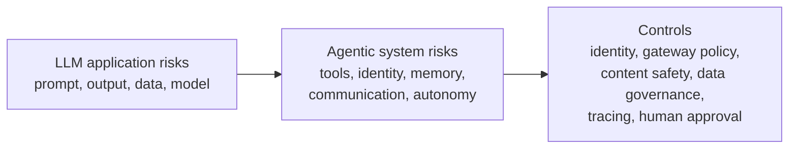

# OWASP control map

This page maps OWASP LLM and agentic AI risks to Microsoft-centric controls. It is a design aid, not a substitute for a threat model.

The OWASP Agentic AI list is newer and more system-focused than the LLM Top 10. The LLM list focuses on model input and output risks. The agentic list adds risks from tools, identity, memory, inter-agent communication, cascading failures, and loss of control.

## Risk evolution

## Compact mapping

| OWASP risk area | Agentic expression | Microsoft-centric controls |
|---|---|---|
| Prompt injection | Agent goal hijack | Azure AI Content Safety Prompt Shields, Foundry evaluations, application authorization, Defender for Cloud AI threat protection. |
| Sensitive information disclosure | Tool misuse and data exfiltration through authorized channels | Microsoft Purview, APIM request and response validation, data-source authorization, DLP, output filtering. |
| Supply chain | Agentic supply chain and compromised tools | GitHub Advanced Security, signed artifacts, API Center registry, APIM as MCP gateway, dependency review. |
| Data and model poisoning | Memory and context poisoning | Purview data controls, retrieval ACLs, ingestion validation, groundedness checks, Foundry evaluations. |
| Improper output handling | Unexpected code execution | Output validation, sandboxed execution, Container Apps dynamic sessions where appropriate, egress restrictions, Defender for Containers. |
| Excessive agency | Tool misuse, identity abuse, rogue behavior | Microsoft Entra ID, workload identities, conditional access, just-in-time access, APIM quotas, human approval. |
| System prompt leakage | Prompt and policy extraction | Prompt Shields, output filtering, prompt separation, least-privilege context, no secrets in prompts. |
| Vector and embedding weakness | Retrieval leakage or poisoned context | Azure AI Search security trimming, source ACLs, Purview labels, retrieval logging, embedding-store access control. |
| Misinformation | Human-agent trust exploitation | Groundedness detection, citations, human review, Foundry evaluations, audit trails. |
| Unbounded consumption | Cascading failures and runaway agents | APIM token limits, cost alerts, circuit breakers, OpenTelemetry traces, kill-switch procedures. |

## Controls by architecture layer

| Layer | Controls |
|---|---|
| Identity | Microsoft Entra ID, workload identities, agent identity where available, short-lived tokens, conditional access, least privilege. |
| Gateway | APIM authentication, authorization, token quotas, request validation, content safety, semantic cache, backend routing, circuit breaker, MCP gateway. |
| Data | Purview labels, DLP, source ACLs, retrieval trimming, data lineage, approved ingestion pipelines. |
| Model and agent | Foundry evaluations, safety filters, tracing, model/router configuration, tool allowlists, memory controls. |
| Operations | Azure Monitor, Application Insights, Defender XDR, Sentinel where used, budget alerts, incident runbooks. |
| Human control | Review and approval for high-impact actions, escalation paths, user-visible citations, audit logs. |

## Design review questions

1. What is the agent allowed to do, and where is that enforced?
2. Which identity does each model, agent, and tool call use?
3. Which tool calls are read-only, write-capable, external, or irreversible?
4. How are prompt injection and indirect prompt injection tested?
5. What stops a single session from consuming too many tokens or tool calls?
6. What happens when a model, MCP server, or downstream API is unavailable?
7. What telemetry links the user, prompt, agent, model call, tool call, and outcome?
8. What data can appear in prompts and responses, and how is it governed?
9. Which actions require human approval?
10. How do you revoke an agent, tool, or model route quickly?
