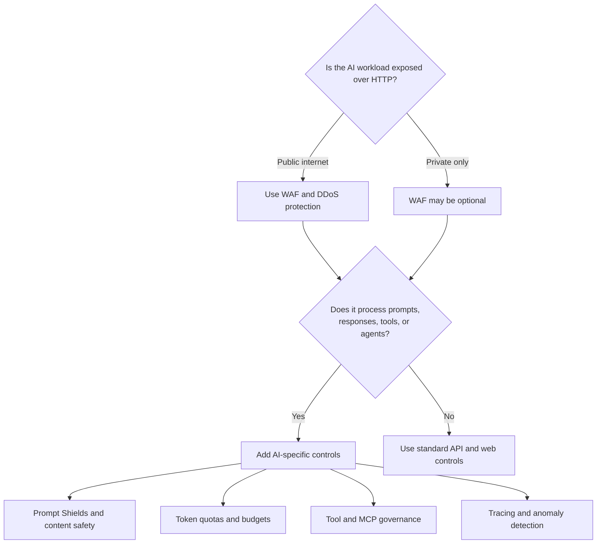

# WAF and AI firewalls

A web application firewall is still useful for AI applications. It is not enough by itself.

The reason is simple: classic WAF rules inspect HTTP behavior and known exploit patterns. AI attacks often use valid natural language, valid API calls, and authorized tools.

## Decision tree

## What a WAF is good at

| Threat area | WAF value |
|---|---|
| SQL injection and XSS | Blocks known web exploit patterns. |
| Request floods and bot traffic | Applies rate limits, bot controls, and DDoS-layer integration. |
| Protocol and request hygiene | Enforces HTTP method, header, body-size, and path constraints. |
| Public edge policy | Provides a consistent perimeter for public web apps and APIs. |

## Where a WAF falls short for AI

| AI risk | Why WAF alone is insufficient |
|---|---|
| Prompt injection | The attack may be ordinary language with no malicious HTTP signature. |
| Indirect prompt injection | Malicious instructions can be hidden in retrieved documents, emails, webpages, or tool metadata. |
| Sensitive information disclosure | The model may generate sensitive output that did not appear in the request. |
| Tool misuse | The agent may call an authorized tool with unsafe parameters. |
| Model or memory poisoning | The attack may happen in data pipelines or retrieval stores, outside the request path. |
| Token exhaustion | Request-count limits do not reflect token cost. |
| Cascading agent failure | Failure can propagate across agents, tools, and model calls after the initial request is accepted. |

## AI-specific controls to add

| Control | Use it for |
|---|---|
| Azure AI Content Safety Prompt Shields | Detect direct prompt attacks and indirect attacks in documents before generation. |
| Content safety output checks | Screen or block unsafe responses before users or downstream systems consume them. |
| APIM token limits | Enforce tokens-per-minute and quota budgets by consumer, app, or team. |
| APIM semantic caching | Reduce repeat model calls and lower cost for semantically similar prompts. |
| Microsoft Purview | Govern sensitive data used in prompts, retrieval, and outputs. |
| Foundry evaluations | Test quality, safety, groundedness, and regressions before production changes. |
| OpenTelemetry tracing | Trace agent decisions, model calls, and tool calls across a workflow. |
| Human approval | Require review before high-impact actions such as payments, deletions, external messages, or privilege changes. |

## Public-facing workload pattern

For a public chatbot, AI API, or agent endpoint, use both categories:

1. Put WAF and DDoS controls at the public edge.
2. Put APIM AI gateway behind the edge to enforce identity, quotas, content safety, backend routing, and logging.
3. Put application authorization and output validation inside the app.
4. Put Foundry evaluations, tracing, and monitoring around the model and agent workflow.
5. Put Purview and data-source authorization around retrieval and sensitive data.

## Internal workload pattern

For internal AI services, the WAF decision depends on network exposure. AI-specific controls still matter because prompt injection, excessive agency, data leakage, and token exhaustion do not require public internet exposure.

Use APIM AI gateway, private endpoints, Microsoft Entra ID, token quotas, content safety, and tool allowlists even when the endpoint is private.

## Language to use in design reviews

Use this wording when you need to explain the difference:

> A WAF protects the web edge. An AI gateway governs AI traffic. Prompt Shields and content safety inspect AI inputs and outputs. Model router optimizes model selection. Tool governance controls what agents are allowed to do.
